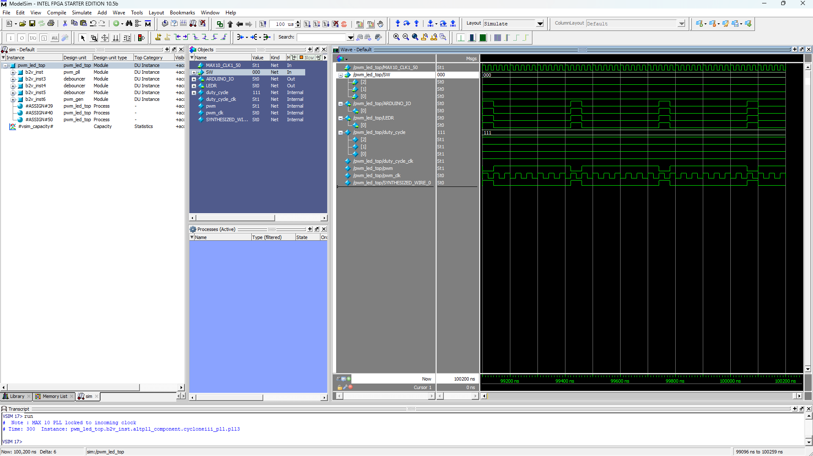

# PWM Controller for DE10-Lite FPGA

## Project Overview
This project implements a Pulse Width Modulation (PWM) controller on the DE10-Lite FPGA board. It controls LED brightness using three toggle switches to adjust the duty cycle in 8 steps (12.5% increments). The design includes:

- **PWM Generator**: 1024-level resolution (0.1% granularity)
- **Debounced Inputs**: Reliable switch readings
- **PLL Clock Management**: Converts 50 MHz system clock to 10 MHz (PWM) and 30 kHz (duty-cycle update)

## Key Features
🔄 **Duty Cycle Control**:
- `SW[0]`: +12.5%
- `SW[1]`: -12.5%
- `SW[2]`: Reset to 0%

💡 **Outputs**:
- `LED[0]`: PWM-driven LED (variable brightness)
- Arduino GPIO Pin: PWM signal for external use

## Implementation Results
### Timing Analysis
  
Maximum clock frequency: XXX MHz

### Resource Utilization
  
- Total logic elements: 4735
- Registers: 3233
- Memory bits: 270,176

## Hardware Setup
  
*Actual implementation showing PWM-controlled LED and switch inputs*

## Simulation Results
### ModelSim Waveforms
  
*Verification of PWM generation and duty cycle control*

## Tools Used
- Quartus Prime 16.1: FPGA design and synthesis
- ModelSim: RTL simulation
- DE10-Lite Hardware: Terasic FPGA board (MAX 10 FPGA)

## Hardware Testing
1. Toggle switches `SW[0]`–`SW[2]` to adjust LED brightness
2. Observe `LED[0]` brightness levels:

| Switches (SW[2:0]) | Duty Cycle | Brightness Level |
|--------------------|------------|------------------|
| 000                | 0%         | Off              |
| 001                | 12.5%      | Low              |
| 010                | 25%        | Medium-Low       |
| 011                | 37.5%      | Medium           |
| 100                | 50%        | Medium-High      |
| 101                | 62.5%      | High             |
| 110                | 75%        | Very High        |
| 111                | 100%       | Full             |

## Simulation
To verify the design in ModelSim:
1. Set `pwm_led_top.v` as the top-level entity
2. Run `Tools → Run Simulation Tool → RTL Simulation`
3. Force SW inputs in the waveform window to test PWM behavior

## Acknowledgments
This project was developed as part of the **FPGA Design for Embedded Systems** specialization capstone project offered by the **University of Colorado Boulder** on Coursera. Special thanks to:

- Course instructors for their guidance on FPGA design methodologies
- Terasic for providing the DE10-Lite development board documentation
- Intel FPGA University Program for their educational resources

The original project requirements and constraints were provided as part of the course curriculum, with implementation details and optimizations developed independently.
